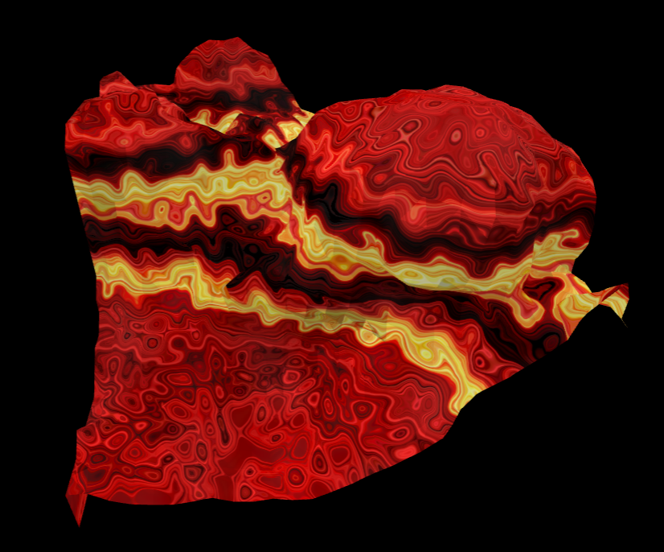

# WebGPU Marching-cube Procedural Terrain

* WebGPU powered
    * Procedural terrain generation by a number of octaves of simplex noise with different frequency and weight
    * Triangulated by marching cubes
    * Color gradient
* Planned (daydreamed) but not done
    * Marble racing…
        * Particle - particle, particle - terrain collision with compute shader
    * … on track
        * Weight map texture input/raycast user interactive input
    * Integration into webgpu-arcade ECS framework (environment for space shooter)

* Based on [toji's metaballs](https://github.com/toji/webgpu-metaballs)

